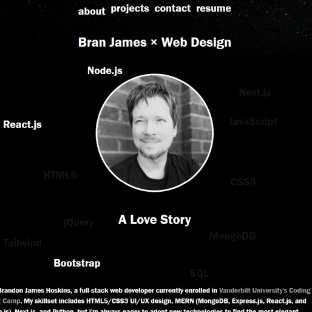

# React Portfolio

## Description

This portfolio website showcases my various coding projects to potential employers, as well as contact information and downloadable versions of my C.V. It is mobile responsive and built with React.js.

## Table of Contents (Optional)

- [Installation](#installation)
- [Usage](#usage)
- [Credits](#credits)
- [License](#license)

## Installation

Clone the repository in a CLI using the command `git clone` to download all source files, then run `npm i` to install all required dependencies.

## Usage

Upload React build files to hosting service such as GitHub Pages.

The landing page is hosted [here](https://branjames117.github.io/brans-portfolio/).

## Credits

Developed from the ground up for the Vanderbilt Coding Boot Camp.

## License

Creative Commons Zero v1.0 Universal
